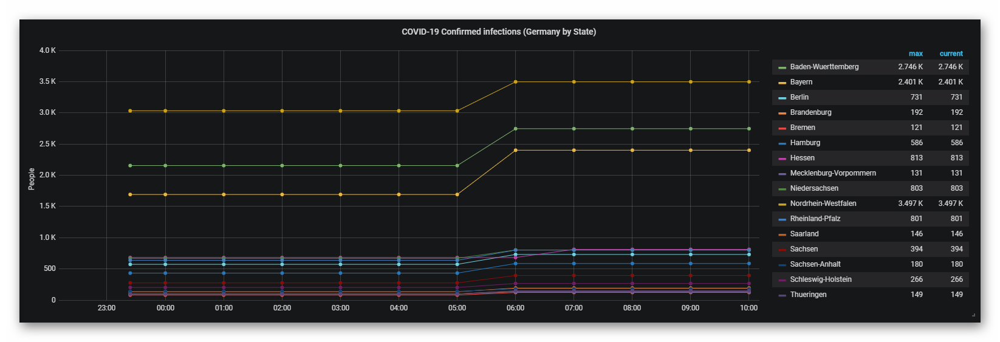
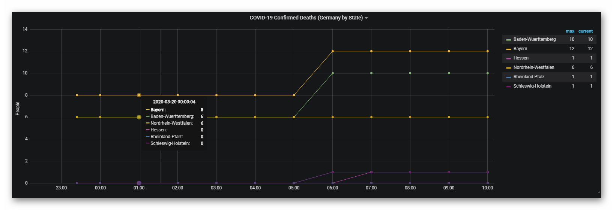
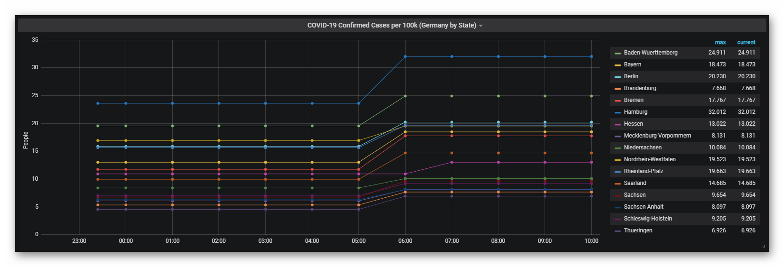
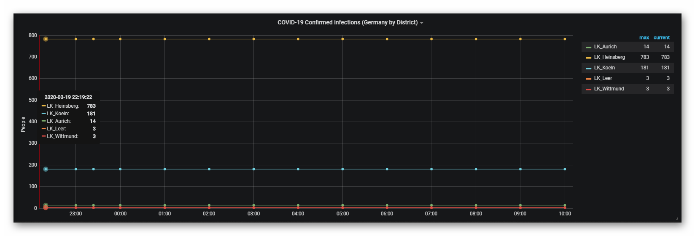

# CovidStats
Import CoViD-19 stats for German states (and rural districts) into InfluxDB

## Requirements
This script is written in Perl and is using Mojolicious as it's basic framework. Therfore you require at least:
* Perl 5.14+
* Mojolicious
* DateTime

As the data is stored in an InfluxDB, you of course also need a running InfluxDB instance that can be reached by this script.

## Configuration
The script consists of two config files: ```conf/CovidStats.conf``` and ```conf/CovidStatsSecret.conf```.

In the first, you need to only adjust the InfluxDB related settings:
```
InfluxDbServer  => '192.168.178.3',
InfluxDbPort    => '8086',
InfluxDbDatabase=> 'covid19',
```
Adjust the parameters accordingly to your local settings.

The latter is not shipped in this repository. Use the example file as base to create your own:
```sh
cd conf
cp CovidStatsSecret.conf.example CovidStatsSecret.conf
```
Now edit the file with your editor of choise (which of course is VIM) and adjust the corresponding settings.

## Execution
To run in production mode (no debug logging), just execute the shell file in the ```bin``` directory:
```sh
cd CovidStats
./bin/collectStats.sh
```

To run the script in development mode execute as follows:
```sh
cd CovidStats
/usr/bin/env perl script/covid_stats run -m development
```

## What data points are available?
The script is able to monitor the following data points by state:
* Confirmed infections
* Confirmed deaths
* Confirmed cases per 100k residents

The following data is available by district:
* Confirmed infections
  
## What does it look like?
Once the data is in your InfluxDB, you can use the built in Chronograf or 3rd party tools like Grafana to visualize the data. For all screenshots I used Grafana

### Confirmed infections (by state)


### Confirmed deaths (by state)


### Confirmed cases per 100k residents (by state)


### Confirmed infections (by district)


## Disclaimer
This script is based on the data from Robert-Koch-Institut (RKI). Even though developed at best knowledge and will, it is possible that this software will contain bugs and, despite best efforts, the developer claims no responsibility nor liable for the data provided by this script.

## Copyright
(C) 2020 by Winni Neessen <wn@neessen.net>

